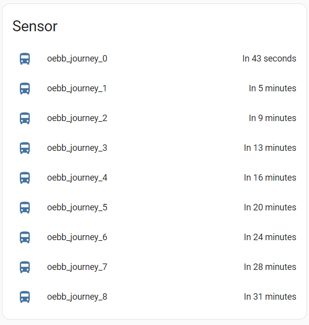

# Get information about next departures

A sensor platform which allows you to get information about departures from a specified OEBB stop.


## Example configuration.yaml

```yaml
sensor:
  platform: oebb
  evaId: 491116
  dirInput: 491123
```

## Configuration variables

key | description
-- | --
**platform (Required)** | The platform name.
**evaID (Required)** | OEBB Stop ID
**dirInput (Optional)** | OEBB stop ID - filter journey stopping there
**boardType (Optional)** | ? 
**tickerID (Optional)** | ? 
**start (Optional)** | ? 
**eqstop (Optional)** | ? 
**showJourneys (Optional)** | ? number of journeys to retreive
**additionalTime (Optional)** | ? offset to query next journeys

## Sample overview



## Notes

To retreive the parameters please vitit the website, choose your stop and check the iframe url:
https://fahrplan.oebb.at/bin/stboard.exe/
Additional info on the parameters can also be found on the getStationBoardDataOptions() docu in the mymro repo - Thanks!

Sources: 
https://github.com/mymro/oebb-api

This platform is using the [OEBB API]([https://fahrplan.oebb.at/bin/stboard.exe/]) API to get the information.

